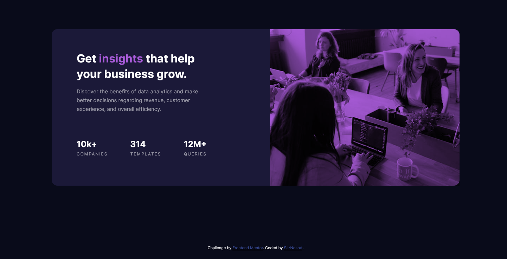

# Frontend Mentor - Stats preview card component solution

This is a solution to the [Stats preview card component challenge on Frontend Mentor](https://www.frontendmentor.io/challenges/stats-preview-card-component-8JqbgoU62). Frontend Mentor challenges help you improve your coding skills by building realistic projects. 

## Table of contents

- [Overview](#overview)
  - [The challenge](#the-challenge)
  - [Screenshot](#screenshot)
- [My process](#my-process)
  - [Built with](#built-with)
  - [What I learned](#what-i-learned)
  - [Continued development](#continued-development)
  - [Useful resources](#useful-resources)
- [Author](#author)
- [Acknowledgments](#acknowledgments)

**Note: Delete this note and update the table of contents based on what sections you keep.**

## Overview

### The challenge

Users should be able to:

- View the optimal layout depending on their device's screen size

### Screenshot



## My process

Started with the **mobile** frist approach and then built the webpage for the desktop design by gradually adding various **@media** queries.

### Built with

- Semantic HTML5 markup
- CSS
- Flexbox

### What I learned

Understood how **flexbox** works and how to allow for the **html** and the **body** box take up the entire viewport without the content of the **body** flowing out of the **html** box.

Below is the code snippet:

```css
.html {
  height: 100%;
}

body {
  min-height: 100vh;
}
```

### Continued development

Refining the solution after testing the webpage on different web browsers.

### Useful resources

- [Freecodecamp article by Dave Gray](https://www.freecodecamp.org/news/html-page-width-height/) - This helped me understand how to add width and height for a full page size; not allowing the content of the **body** to flow out of the **html** box.

## Author

- GitHub- [Shahin](https://github.com/SJ-Nosrat)
- Frontend Mentor - [@shahin1987](https://www.frontendmentor.io/profile/shahin1987)

## Acknowledgments

Freecodecamp and the various YouTubers!
